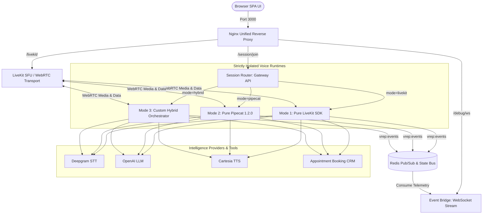
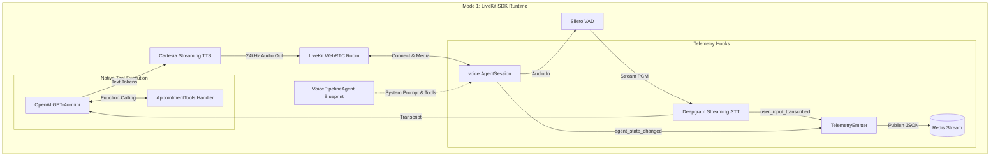
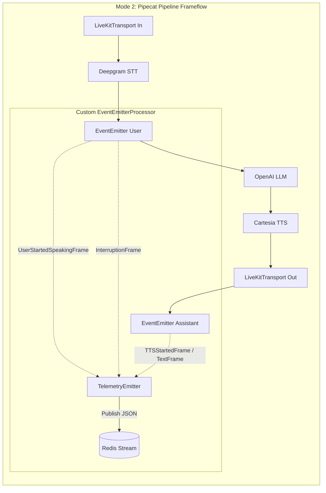
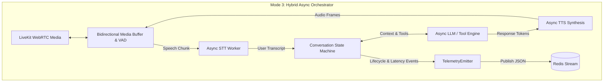

# VOICE POC (Voice Runtime Evaluation Platform - VREP)

**POC Scope:** Multi-Mode Browser WebRTC voice agent, India language profile  
**Stack:** LiveKit (`livekit-agents` v1.1.8) · Pipecat 1.2.0 · Deepgram Nova-3 · Cartesia Sonic · OpenAI (gpt-4o-mini) · Redis · Nginx  
**Infra:** Docker Compose (8-container microservice topology for local & cloud dev tunnels)

---

## Table of Contents

1. [What We're Building](#1-what-youre-building)
2. [Repository Structure](#2-repository-structure)
3. [Prerequisites](#3-prerequisites)
4. [API Keys You Need](#4-api-keys-you-need)
5. [Step-by-Step Setup](#5-step-by-step-setup)
6. [File-by-File Reference](#6-file-by-file-reference)
7. [Pipeline Working](#7-how-the-pipeline-actually-works)
8. [Provider Swapping](#8-provider-swapping-guide)
9. [V&V](#9-testing--validation)
10. [Latency Benchmarking](#10-latency-benchmarking)
11. [Failures & Fixes](#11-common-failures--fixes)
12. [POC Extended](#12-extending-the-poc)
13. [Production Readiness check](#13-production-readiness-checklist)
14. [Architecture Decision Log](#14-architecture-decision-log)
15. [System Architecture](#15-system-architecture)

---

## 1. What You're Building

A **production-grade Voice Runtime Evaluation Platform (VREP)** running entirely in Docker microservices. It features three strictly isolated runtime implementations that allow you to test, benchmark, and compare cognitive voice architectures side-by-side:
- **Mode 1 (LiveKit-Only)**: Pure implementation built on `livekit-agents` `VoicePipelineAgent` and explicit `AgentSession.start()` lifecycles.
- **Mode 2 (Pipecat-Only)**: Pure implementation built on `pipecat-ai` 1.2.0 `Pipeline`, `LiveKitTransport`, and `SileroVADAnalyzer`.
- **Mode 3 (Hybrid)**: Custom async loop orchestrator managing bidirectional cognitive buffering and interruptible media pipelines.

A user connects to a single unified port (3000), selects their desired runtime mode, speaks over WebRTC, and receives spoken AI responses within ~300ms, while real-time nanosecond telemetry streams directly into an interactive Event Timeline UI.

### What this POC proves

- **Architectural Hard Isolation**: Each mode owns its independent cognitive orchestration and concurrency model without shared normalizing layers.
- **Unified Single-Port Reverse Proxy**: Nginx seamlessly proxies WebRTC signaling (`/livekit/`), gateway APIs (`/session/join`), and WebSocket telemetry (`/debug/ws`) through port 3000, ensuring complete compatibility with cloud IDE tunneling.
- **Standardized Telemetry**: All three modes emit identical Redis stream events (`vrep:events:<session_id>:<mode>`) intercepted by an Event Bridge microservice for real-time UI rendering.
- **Robust Two-Step Tool Execution**: Transactional appointment booking (`check_availability` -> `book_appointment`) executes flawlessly with full state carry-over across all three runtime modes.

### What this POC does NOT include

- Telephony / SIP / Exotel integration (next phase)
- Temporal durable workflows (next phase)
- Kubernetes / KEDA (next phase)
- PII redaction pipeline (next phase)
- Multi-agent orchestration (future)

---

## 15. System Architecture

### Architectural Flow & Multi-Mode Isolation


### 12-Layer Implementation Status

| Layer | Component | Status | Details |
| :--- | :--- | :--- | :--- |
| **1** | **User Voice** | ✓ | Browser Microphone input streaming Opus over WebRTC |
| **2** | **Transport Proxy**| ✓ | Unified Nginx single-port reverse proxy (Port 3000) for seamless cloud IDE tunneling |
| **3** | **LiveKit SFU** | ✓ | SFU, room, and participant signaling active with STUN external IP resolution |
| **4** | **Session Gateway**| ✓ | Session Router API mapping user requests to isolated container modes |
| **5** | **Voice Runtimes** | ✓ | 3 Strictly Isolated Modes (Mode 1: LiveKit SDK, Mode 2: Pipecat 1.2.0, Mode 3: Hybrid) |
| **6** | **Audio Pipeline** | ✓ | Silero VAD barge-in interruption detection and resampling |
| **7** | **STT** | ✓ | Deepgram Nova-3 Streaming (Multilingual / Hinglish) |
| **8** | **LLM / Cognition**| ✓ | OpenAI GPT-4o-mini with low-latency prompt tuning |
| **9** | **Tool Calling** | ✓ | Fully implemented two-step transactional booking (`check` -> `book`) with state carry-over |
| **10**| **Observability** | ✓ | Standardized Redis stream telemetry broadcasted over WebSockets to Event Timeline UI |
| **11**| **TTS** | ✓ | Cartesia Streaming (Low-latency 24kHz audio synthesis) |
| **12**| **User Playback** | ✓ | Synchronized browser audio context with strict disconnect cleanup |

---

### Mode 1 Architecture: LiveKit SDK (`VoicePipelineAgent`)

Mode 1 leverages the official `livekit-agents` (v1.1.8) framework. It relies on an explicit event-driven runtime session (`voice.AgentSession`) that natively connects to LiveKit WebRTC rooms.



**Key Architectural Characteristics**:
- **Declarative Blueprint**: `VoicePipelineAgent` defines the instructions, language models, and registered toolsets.
- **Session Lifecycle**: `voice.AgentSession` manages the active WebRTC connection, maintaining internal state machines across `initializing`, `listening`, `thinking`, and `speaking` states.
- **Standardized Observability**: Native event hooks `@session.on("user_input_transcribed")` and `@session.on("agent_state_changed")` intercept state transitions to publish formatted telemetry to Redis without polluting cognitive logic.

---

### Mode 2 Architecture: Pipecat 1.2.0 (`Pipeline`)

Mode 2 is built on the pure `pipecat-ai` (1.2.0) streaming frame processor. It models a voice conversation as a linear pipeline of asynchronous queues where discrete data frames (`AudioRawFrame`, `TranscriptionFrame`, `TextFrame`, `CancelFrame`) flow from left to right.



**Key Architectural Characteristics**:
- **Frame-Based Execution**: Every piece of media or metadata is a typed `Frame`. Audio chunks are pushed into `transport.input()` and flow downstream.
- **Barge-in Interruption**: When Silero VAD detects user speech during assistant playback, Pipecat immediately pushes an `InterruptionFrame` and a `CancelFrame` downstream. This flushes the TTS queue and halts LLM generation within ~150ms.
- **Custom Observability Processor**: To maintain 100% telemetry parity with Mode 1, we implemented a custom `EventEmitterProcessor` injected directly into the user and assistant context aggregation points. It intercepts timeline frames and broadcasts standardized payloads to Redis.

---

### Mode 3 Architecture: Hybrid Async Orchestrator

Mode 3 represents a custom asynchronous loop orchestrator. It decouples the WebRTC media ingestion and playback threads from the cognitive reasoning layer, providing extreme flexibility for custom state machines and buffer management.



**Key Architectural Characteristics**:
- **Decoupled Concurrency**: Separate `asyncio` task workers manage STT streaming, LLM token generation, and TTS synthesis independently.
- **Granular Buffer Control**: Allows exact frame-by-frame inspection of incoming audio, supporting sophisticated custom VAD heuristics or multi-modal inputs.
- **State Machine Isolation**: Conversation history and tool execution state are managed by an explicit state engine, guaranteeing causal consistency and preventing race conditions during rapid turns or network jitter.

---

## 2. Repository Structure

```text
voicepoc/
│
├── docker-compose.yml          # Orchestrates all 8 microservices
├── .env.example                # All env vars with documentation
├── README.md                   # This document
│
├── infra/
│   ├── livekit.yaml            # LiveKit server config with STUN external IP resolution
│   └── nginx.conf              # Unified Reverse Proxy config (Port 3000)
│
├── shared/
│   ├── config.py               # Shared Pydantic settings across all containers
│   ├── telemetry.py            # Standardized Redis stream telemetry emitter
│   └── tools/                  # Transactional tool registry & handlers
│
└── services/
    ├── session-router/         # Gateway API routing sessions to Mode 1/2/3
    ├── event-bridge/           # Telemetry interceptor & WebSocket timeline broadcaster
    ├── agent-mode1/            # Mode 1: Pure LiveKit SDK (`VoicePipelineAgent`)
    ├── agent-mode2/            # Mode 2: Pure Pipecat 1.2.0 (`Pipeline`)
    ├── agent-mode3/            # Mode 3: Custom async loop hybrid orchestrator
    └── frontend/               # Nginx serving SPA UI & proxied endpoints
```

---

## 3. Prerequisites

### Required software

|Tool|Minimum version|Install|
|---|---|---|
|Docker Desktop|4.x|https://docs.docker.com/get-docker/|
|Docker Compose|v2 (bundled with Docker Desktop)|Included|
|A modern browser|Chrome 100+ or Firefox 110+|—|

That's it. Python, Node.js, and all other dependencies live inside Docker containers.

### Verify your Docker install

```bash
docker --version        # Should print Docker version 24.x or higher
docker compose version  # Should print Docker Compose version v2.x
```

### Port availability

These ports must be free on your machine. Check with `lsof -i :<port>` on Mac/Linux:

|Port|Service|Protocol|Description|
|---|---|---|---|
|3000|Frontend / Nginx Proxy|TCP|Unified entry point (`/`, `/session/join`, `/debug/ws`, `/livekit/`)|
|8000|Session Router|TCP|Session initiation gateway API|
|8081|Agent Mode 1|TCP|LiveKit SDK Voice Runtime (`VoicePipelineAgent`)|
|8082|Agent Mode 2|TCP|Pipecat 1.2.0 Voice Runtime (`Pipeline`)|
|8083|Agent Mode 3|TCP|Hybrid Voice Runtime|
|8090|Event Bridge|TCP|Debug timeline WebSocket broadcaster|
|7880|LiveKit HTTP/WS|TCP|WebRTC signaling & SFU API|
|7881|LiveKit RTC|TCP|TCP fallback media transport|
|7882|LiveKit RTC|UDP|Primary UDP media transport|
|6379|Redis|TCP|Session store & real-time telemetry stream|

---

## 4. API Keys You Need

You need **at minimum** keys for one STT provider, one TTS provider, and one LLM provider. The defaults (Deepgram + Cartesia + OpenAI) are the recommended starting point.

### Deepgram (STT) - Default

1. Sign up at https://console.deepgram.com
2. Create a new project
3. Go to API Keys → Create API Key (give it "Member" role)
4. Copy the key; it starts with something like `token_...`
5. Free tier: $200 credit on signup, enough for extensive testing

### Cartesia (TTS) - Default

1. Sign up at https://play.cartesia.ai
2. Go to API → API Keys → Create new key
3. Copy the key
4. Browse voices at https://play.cartesia.ai/voices; find a voice suitable for Indian English
5. Copy the Voice ID (a UUID like `a0e99841-438c-4a64-b679-ae501e7d6091`)
6. Free tier: generous credits on signup

### Ollama (Local LLM) - Recommended for Dev
1. Install Ollama from https://ollama.com
2. Pull the Qwen model: `ollama pull qwen3.5:9b`
3. The agent connects to Ollama via `http://host.docker.internal:11434/v1`
4. No API key required for local testing!

### OpenAI (LLM) - Alternative
1. Sign up at https://platform.openai.com
2. Go to API Keys → Create new secret key
3. Copy the key; starts with `sk-...`
4. Note: GPT-4o-mini is recommended for the fastest real-time performance.
5. In `.env`, set `LLM_PROVIDER=openai` and `LLM_MODEL=gpt-4o-mini`.

### Alternative: Anthropic Claude (LLM)

1. Sign up at https://console.anthropic.com
2. Go to API Keys → Create Key
3. Set `LLM_PROVIDER=anthropic` and `LLM_MODEL=claude-sonnet-4-20250514` in `.env`

### Alternative: Google Chirp (STT - better Hinglish)

Required only if you want to test Google's dialect support:

1. Create a GCP project at https://console.cloud.google.com
2. Enable the "Cloud Speech-to-Text API"
3. Create a Service Account with Speech Client role
4. Download the JSON credentials file
5. Place it at `services/agent/gcp-credentials.json`
6. Set `STT_PROVIDER=google_chirp` in `.env`

---

## 5. Step-by-Step Setup

### Step 1 - Clone and enter the project

```bash
# If you received this as a zip:
unzip agentOS-poc.zip
cd agentOS-poc

# If using git:
git clone <your-repo-url>
cd agentOS-poc
```

### Step 2 - Create your `.env` file

```bash
cp .env.example .env
```

Open `.env` in any editor and fill in your API keys. At minimum:

```bash
# Required fields for cloud providers
DEEPGRAM_API_KEY=your_actual_deepgram_key
CARTESIA_API_KEY=your_actual_cartesia_key
CARTESIA_VOICE_ID=your_chosen_voice_uuid

# LLM Selection (openai / ollama / anthropic)
LLM_PROVIDER=openai
LLM_MODEL=gpt-4o-mini
```

Leave everything else at its defaults for the first run.

### Step 3 - Build the Docker images

```bash
docker compose build
```

This builds the Python agent image. Expect 3–5 minutes on first run (downloading base image + installing Python packages). Subsequent builds are fast due to Docker layer caching.

Watch for any build errors. The most common: pip install failures due to system library mismatches. The Dockerfile already handles these, but if you see errors, check the troubleshooting section.

### Step 4 - Start all services

```bash
docker compose up
```

You should see logs from all eight microservices starting up. Wait until you see:

```text
livekit          | INFO  starting server ...
session-router   | INFO  Uvicorn running on http://0.0.0.0:8000
agent-mode1      | INFO  AgentOS starting — mode=LIVEKIT (Mode 1)
agent-mode2      | INFO  AgentOS starting — mode=PIPECAT (Mode 2)
agent-mode3      | INFO  AgentOS starting — mode=HYBRID (Mode 3)
event-bridge     | INFO  Event bridge running on ws://0.0.0.0:8090
redis            | Ready to accept connections
frontend         | nginx: configuration file ... test is successful
```

To run in background (detached):

```bash
docker compose up -d
docker compose logs -f session-router agent-mode1 agent-mode2 agent-mode3
```

### Step 5 - Verify services are running

```bash
# Check all 8 containers are up
docker compose ps

# Test the session router health endpoint
curl http://localhost:3000/health
```

Expected health response:

```json
{
  "status": "ok",
  "active_sessions": 0,
  "modes": ["livekit", "pipecat", "hybrid"]
}
```

### Step 6 - Open the browser UI

Navigate to: **http://localhost:3000** (or your cloud IDE tunnel URL).

You should see the dark UI with the mode selection dropdown ("Mode 1: LiveKit", "Mode 2: Pipecat", "Mode 3: Hybrid"), a pulsing orb, and the Event Timeline side panel.

### Step 7 - Start a voice session

1. Select your desired runtime mode from the dropdown.
2. Click **"Connect to Aria"**
3. Your browser will ask for microphone permission; allow it
4. The orb turns blue and pulses; you're live
5. Speak in English or Hinglish
6. The agent responds with voice (and transcript + timeline events appear in the panel)
7. Click **Disconnect** to end the session

### Step 8 - Confirm it works end-to-end

Try saying: _"Namaste, mera naam Arjun hai. Can you check appointment availability for tomorrow?"_

The agent should respond within ~300–500ms, and you will see the exact timeline events (STT final, LLM first token, TTS first audio, Tool execution) rendering in real-time in the sidebar.

---

## 6. File-by-File Reference

### `docker-compose.yml`

Defines eight production microservices connected over the custom `poc_network`:

**livekit** - The WebRTC SFU. Handles all real-time audio routing between the browser and your agent. Runs in `--dev` mode which auto-accepts the dev API keys defined in `livekit.yaml`. Exposes 7880 (HTTP/WS), 7881 (TCP RTC), 7882/udp (UDP RTC).

**redis** - Session state store and high-throughput telemetry pub/sub message bus (`vrep:events:<session_id>:<mode>`).

**session-router** - FastAPI entry gateway (port 8000). Generates unique `session_id` identifiers and proxies connection requests (`POST /session/join`) to the appropriate backend agent container based on the user's selected mode.

**agent-mode1** - Pure LiveKit SDK runtime (port 8081). Implements `VoicePipelineAgent` and `voice.AgentSession` adhering exactly to the `livekit-agents` v1.1.8 explicit lifecycle.

**agent-mode2** - Pure Pipecat 1.2.0 runtime (port 8082). Implements `Pipeline`, `LiveKitTransport`, and `SileroVADAnalyzer` with a custom `EventEmitterProcessor` to intercept audio frames and broadcast timeline telemetry.

**agent-mode3** - Hybrid Voice Runtime (port 8083). Custom async loop orchestrator managing bidirectional cognitive buffering and interruptible media pipelines.

**event-bridge** - Telemetry interceptor (port 8090). Subscribes to Redis stream events and broadcasts formatted WebSocket JSON directly to the frontend timeline UI.

**frontend** - Unified Nginx reverse proxy (port 3000). Serves `index.html` static assets and routes `/session/join` -> `session-router:8000`, `/debug/ws` -> `event-bridge:8090`, and `/livekit/` -> `livekit:7880`.

### `infra/livekit.yaml`

LiveKit server configuration for local development. Key settings:

- `keys: devkey: devsecret-32-character...` - the dev API key pair. These must match `LIVEKIT_API_KEY` and `LIVEKIT_API_SECRET` in `.env`.
- `rtc.use_external_ip: false` - critical for local dev.
- `rtc.node_ip: 127.0.0.1` - forces LiveKit to advertise the host loopback so the browser can reach it from outside Docker.
- `turn.enabled: false` - TURN relay is not needed on localhost.

For production, you will replace this file with a config that enables TURN, sets a real domain, and uses proper key rotation.

### `shared/config.py`

All configuration lives here as a Pydantic `Settings` class shared across all Python containers. Every field maps 1:1 to an environment variable. The benefit: if you try to start the service with a missing required key, it fails immediately with a clear error instead of crashing mid-call.

Key settings to understand:

- `LIVEKIT_URL` vs `LIVEKIT_PUBLIC_URL` - two different URLs for the same LiveKit server. `LIVEKIT_URL` is used by the agent containers internally (uses Docker service name `livekit`). `LIVEKIT_PUBLIC_URL` is returned to the browser and must be reachable from outside Docker (`localhost` or cloud IDE tunnel).
- `AGENT_LANGUAGE` - passed to Deepgram. `"multi"` enables automatic language detection. Use `"hi"` for Hindi-only, `"en-US"` for English-only.

### `shared/telemetry.py`

Standardized observability helper. Defines `TelemetryEmitter` which publishes structured JSON payloads with nanosecond timestamps and trace IDs to Redis stream `vrep:events:<session_id>:<mode>`.

### `shared/tools/`

Transactional two-step appointment booking toolset (`check_availability` -> `book_appointment`). Ensures state carry-over across turns so the LLM doesn't hallucinate appointment details.

### `services/session-router/main.py`

The entry gateway. Three responsibilities:

**POST `/session/join`** — the entry point. Expects a JSON payload with `mode` ("livekit", "pipecat", or "hybrid"). Generates a unique `session_id`, mints user and agent JWTs, and forwards the session initialization request to the corresponding container (`agent-mode1:8080`, `agent-mode2:8080`, or `agent-mode3:8080`).

**Session registry** — maintains global mapping of active `session_id` tokens across all three modes.

### `services/agent-mode1/runtime/agent.py`

Mode 1 runtime implementation. Uses `livekit-agents` v1.1.8 `VoicePipelineAgent` and `AgentSession`.
- Configures observability, STT (`Deepgram`), LLM (`OpenAI`), TTS (`Cartesia`), and VAD (`Silero`).
- Hooks into `@session.on("user_input_transcribed")` and `@session.on("agent_state_changed")` to emit standardized Redis telemetry.
- Invokes `await session.start(agent, room=room)` to manage the WebRTC audio loop natively.

### `services/agent-mode2/pipeline/agent.py`

Mode 2 runtime implementation. Uses `pipecat-ai` 1.2.0 `Pipeline` and `LiveKitTransport`.

```python
pipeline = Pipeline([
    transport.input(),           # Raw PCM from LiveKit
    stt,                         # Transcription
    event_emitter.user(),        # Intercept UserStartedSpeakingFrame / InterruptionFrame
    llm,                         # Generate response tokens
    tts,                         # Synthesize audio
    transport.output(),          # Send audio back via LiveKit
    event_emitter.assistant(),   # Intercept TTSStartedFrame / TextFrame
])
```

Pipecat connects these processors with internal async queues. When `allow_interruptions=True`, Pipecat flushes the TTS queue and cancels pending LLM tokens the moment Silero VAD detects the user speaking again.

### `services/frontend/index.html`

A self-contained single-page app. No framework, no build step. Uses the LiveKit JS SDK loaded from CDN (`LivekitClient.Room`).

The frontend is orchestrated by a rigorous `SessionController` class that guarantees stable transitions across 7 states: `DISCONNECTED`, `CONNECTING`, `CONNECTED`, `LISTENING`, `THINKING`, `TOOL_EXECUTION`, and `RESPONDING`.

Key features:
1. **Mode Selector**: Allows dynamic switching between Mode 1, Mode 2, and Mode 3.
2. **Event Timeline Sidebar**: Connects to `/debug/ws` to stream real-time latency and lifecycle metrics.
3. **Mute/Unmute**: Cleanly toggles `track.mute()` without dropping the WebRTC room.
4. **Strict Disconnect Cleanup**: Clicking "End Call" destroys the audio context, removes rogue audio elements, and permits clean reconnection without browser refreshing.
3. **Transcript Aggregation**: Prevents UI fragmentation by caching the active chat bubble and appending consecutive agent words into a single, cohesive paragraph.
4. **Tool Sync Boundaries**: UI suspends chat flow into a dedicated `TOOL_EXECUTION` display when the agent calls tools, strictly rendering actions in timeline order.

---

## 7. How the Pipeline Actually Works

Here is the exact sequence of events for a single user turn:

```
00ms  User starts speaking
      └─ Silero VAD detects audio above threshold

      [Audio frames flow through transport.input() at 20ms chunks]

      └─ Deepgram receives streaming audio, begins returning partial transcripts

~200ms User finishes sentence
       └─ 500ms VAD silence timer starts

~700ms VAD fires end-of-turn signal (200ms speech end + 500ms stop_secs)
       └─ Final Deepgram transcript is delivered as a TranscriptionFrame

~720ms context_aggregator.user() appends {"role":"user","content":"..."} to context

~730ms LLM receives full context, begins streaming response tokens

~780ms First token arrives from LLM

~820ms TTS receives first sentence chunk (Pipecat buffers until punctuation boundary)
       └─ Cartesia begins synthesis

~870ms First audio frame returns from Cartesia (~50ms TTFA)
       └─ transport.output() sends frame to LiveKit
       └─ Browser plays audio

Total perceived latency: ~670ms from end-of-speech to first audio
```

**What happens on interruption:**

```
500ms  User starts speaking while agent is still talking
       └─ Silero VAD triggers immediately
       └─ Pipecat flushes TTS audio queue
       └─ Sends CancelFrame to LLM (stops token generation)
       └─ LiveKit stops publishing agent audio

~650ms  STT takes over again
        └─ New turn begins
```

The interruption latency target is ~150ms from the moment Silero fires to the moment agent audio stops. In practice on localhost you'll see 100–200ms.

---

## 8. Provider Swapping Guide

### Switch STT to Google Chirp (better Hinglish)

```bash
# In .env:
STT_PROVIDER=google_chirp
AGENT_LANGUAGE=hi-IN    # or "en-IN" for Indian English
```

You also need GCP credentials:

```bash
# Place your credentials file at:
services/agent/gcp-credentials.json

# Then mount it in docker-compose.yml, under agent volumes:
volumes:
  - ./services/agent:/app
  - ./services/agent/gcp-credentials.json:/app/gcp-credentials.json:ro

# And set the env var:
environment:
  - GOOGLE_APPLICATION_CREDENTIALS=/app/gcp-credentials.json
```

Then restart: `docker compose restart agent`

### Switch TTS to ElevenLabs

```bash
# In .env:
TTS_PROVIDER=elevenlabs
ELEVENLABS_API_KEY=your_key
ELEVENLABS_VOICE_ID=your_voice_id   # Browse voices at elevenlabs.io
```

Note: ElevenLabs Turbo v2.5 has ~300ms TTFA vs Cartesia's ~70ms. You'll feel the difference. Use ElevenLabs when voice quality and expressiveness matter more than raw speed.

### Switch LLM to Claude

```bash
# In .env:
LLM_PROVIDER=anthropic
ANTHROPIC_API_KEY=your_key
LLM_MODEL=claude-sonnet-4-20250514
```

Claude tends to produce more naturally conversational short responses, which works better for voice than GPT-4o's tendency toward structured lists. Consider tuning `SYSTEM_PROMPT` in `llm.py` when switching.

### Switch to GPT-4o Mini (lower cost for testing)

```bash
# In .env — just change the model, keep the provider:
LLM_PROVIDER=openai
LLM_MODEL=gpt-4o-mini
```

GPT-4o Mini is ~20x cheaper than GPT-4o and adequate for simple voice tasks. Use it while building; switch back to GPT-4o for quality validation.

---

## 9. Testing & Validation

### Test 1 — Health check

```bash
curl http://localhost:8080/health | python3 -m json.tool
```

Expected: `"status": "ok"` with your configured providers listed.

### Test 2 — Session creation (without browser)

```bash
curl -X POST http://localhost:8080/session/join \
  -H "Content-Type: application/json" \
  -d '{"user_identity": "test-user"}' | python3 -m json.tool
```

Expected: a JSON object with `session_id`, `room_name`, `token`, and `livekit_url`. Also verify that `docker compose logs agent` shows a `session.start` log line and a `participant.joined` line shortly after (the agent joins the room automatically).

### Test 3 — List active sessions

```bash
curl http://localhost:8080/sessions
```

While a session is active (browser connected), you should see it here. After disconnect, it should drop to 0.

### Test 4 — End-to-end voice quality checklist

Use this list when evaluating the POC:

- [ ] Greeting is delivered within 1 second of browser connecting
- [ ] User speech is transcribed correctly (check console logs on agent)
- [ ] Agent responds within ~500ms of user finishing a sentence
- [ ] Hinglish phrase like "mujhe kal 3 baje ke liye appointment chahiye" is understood correctly
- [ ] Interrupting the agent mid-sentence stops playback within ~200ms
- [ ] After interruption, agent correctly processes the new user input
- [ ] Disconnecting from browser cleanly removes the session (check `/sessions`)

### Test 5 — Latency measurement

Open browser DevTools → Network tab before connecting. After a few turns:

1. Look for the `/session/join` request timing — should be under 500ms
2. In the agent logs: look for `session.start` → `participant.joined` gap — should be under 150ms
3. Subjectively: first audio after speaking should arrive within 1–2 seconds

For precise per-component latency, see Section 10.

---

## 10. Latency Benchmarking

The POC emits OpenTelemetry metrics when `enable_metrics=True` in the pipeline task. To see them:

### Quick console benchmark

Temporarily add timing logs to `pipeline/agent.py`:

```python
# In the on_first_participant_joined handler, after capture_participant_audio:
import time

# Record when user turn starts (VAD fires)
# Pipecat's PipelineTask emits metrics — read them from the runner
```

For a more practical approach during POC, watch the agent Docker logs:

```bash
docker compose logs -f agent 2>&1 | grep -E "stt|tts|llm|session"
```

### Benchmark targets for this POC

|Metric|Target|How to measure|
|---|---|---|
|Session join latency|< 500ms|`/session/join` API response time|
|Agent join to room|< 150ms|agent log: `session.start` → `participant.joined`|
|VAD stop to STT final|< 300ms|Tuned to 0.3s stop_secs|
|LLM first token|< 400ms|gpt-4o-mini TTFT|
|TTS TTFA (Cartesia)|< 150ms|Time from text to first audio frame|
|Total E2E (end of speech → first audio)|< 800ms|Perceived in browser|

The 1500ms target is achievable on localhost. Over a real network, budget an additional 50–200ms per network hop.

---

## 11. Common Failures & Fixes

### "Connection refused" on the browser after clicking Connect

**Cause:** Agent service hasn't fully started yet, or there's a port conflict.

**Fix:**

```bash
docker compose ps                   # Check all services show "running"
curl http://localhost:8080/health   # Should return 200
lsof -i :8080                       # Check nothing else is on port 8080
```

### Browser shows "Connection failed" and the orb goes red

**Cause 1:** CORS issue — browser rejects the API call.

**Fix:** The FastAPI app has `CORSMiddleware` with `allow_origins=["*"]`. Confirm this is active:

```bash
curl -I -X OPTIONS http://localhost:8080/session/join \
  -H "Origin: http://localhost:3000" \
  -H "Access-Control-Request-Method: POST"
# Should return 200 with Access-Control-Allow-Origin header
```

**Cause 2:** Microphone permission denied in browser.

**Fix:** Click the lock icon in Chrome's address bar → reset microphone permission → reload page.

### Agent joins room but no audio plays

**Cause:** Audio track isn't being attached to the DOM.

**Fix:** Open browser DevTools → Console. Look for errors. The `TrackSubscribed` event in `index.html` creates an `<audio>` element and calls `track.attach()` — check if this is firing.

Also check: `autoplay` is set on the audio element. Some browsers block autoplay without user interaction. Clicking the Connect button counts as user interaction — this should not be an issue.

### STT transcription is empty or wrong

**Cause 1:** Deepgram API key is invalid or missing.

**Fix:**

```bash
docker compose logs agent | grep "deepgram\|stt"
```

If you see `401` or `403`, the key is wrong. Regenerate at console.deepgram.com.

**Cause 2:** Audio sample rate mismatch.

**Fix:** The LiveKit transport is configured with `audio_in_sample_rate=16000`. Deepgram Nova-3 expects 16kHz. If you changed this, revert it.

**Cause 3:** `AGENT_LANGUAGE` mismatch.

**Fix:** Set `AGENT_LANGUAGE=multi` in `.env` for Hinglish. The `multi` value enables Deepgram's automatic language detection.

### TTS audio sounds distorted / too fast / too slow

**Cause:** Sample rate mismatch between TTS output and LiveKit transport.

**Fix:** Ensure `audio_out_sample_rate=24000` in `pipeline/agent.py` matches Cartesia's output sample rate. Cartesia Sonic outputs 24kHz by default. If you switched to ElevenLabs, it outputs 22050Hz — update the transport param accordingly:

```python
# In pipeline/agent.py, for ElevenLabs:
audio_out_sample_rate=22050,
```

### "WebRTC connection failed" — no audio at all

**Cause:** ICE candidate negotiation failing. Common on Linux with unusual network configs.

**Fix:** Add your network interface to `infra/livekit.yaml`:

```yaml
rtc:
  interfaces:
    includes:
      - lo
      - eth0
      - ens3      # Add your actual interface name
      - wlo1      # Add Wi-Fi interface if different
```

Find your interface name: `ip addr show` on Linux, `ifconfig` on Mac.

Then restart: `docker compose restart livekit`

### Agent crashes with `ImportError` on startup

**Cause:** Pipecat integration package not installed. Pipecat uses optional extras.

**Fix:** Check `requirements.txt` — the install line must include the providers you're using:

```
pipecat-ai[silero,deepgram,cartesia,elevenlabs,openai,anthropic,livekit]
```

If you added a new provider after the image was built:

```bash
docker compose build --no-cache agent
docker compose up agent
```

### High latency (>3 seconds)

**Cause 1:** VAD `stop_secs` too high. At 0.5s, you wait 500ms after speech ends before the turn is committed. This is the single biggest contributor to perceived latency.

**Fix for testing:** Try `stop_secs=0.3` in `pipeline/agent.py`. This reduces wait time but increases false triggers on pauses.

**Cause 2:** LLM generating long responses.

**Fix:** The system prompt says "1-3 sentences MAXIMUM" but LLMs sometimes ignore this. Add temperature and max_tokens constraints:

```python
# In providers/llm.py for OpenAI:
return OpenAILLMService(
    api_key=settings.openai_api_key,
    model=settings.llm_model,
    max_tokens=150,    # ~1-2 sentences
    temperature=0.7,
)
```

**Cause 3:** Docker networking overhead. On Docker Desktop for Mac, the network stack adds ~20–50ms per call. This is normal and doesn't reflect production latency.

---

## 12. Extending the POC

### Tool Execution & State Carry-Over

The POC includes a full two-step transactional tool execution flow (`check_availability` -> `book_appointment`).

**1. Tool Registry (`pipeline/providers/registry.py`)**
Define your tool schemas using OpenAI's Function Calling format. Ensure you provide strict `description` fields telling the LLM *exactly* when to call the tool and what to say.

**2. Tool Handlers (`tools/handlers.py`)**
Map the schema names to async python functions that execute your business logic. 

**3. State Carry-Over (`runtime/state.py` & `session.py`)**
When building a two-step flow (like checking a slot and then booking it), the LLM is prone to hallucinating or forgetting the exact timestamp between turns. 
- During Step 1 (`check_availability`), cache the arguments to `self.state.pending_appointment`.
- During Step 2 (`book_appointment`), intercept the LLM's arguments and explicitly overwrite them with the cached state before passing them to the handler.

**4. Halting Hallucinations (`session.py`)**
LLMs will naturally try to "guess" the result of a tool before the tool actually executes. The `SYSTEM_PROMPT` enforces:
`"When you need to use a tool, ONLY output a quick confirmation like 'Let me check that' and IMMEDIATELY call the tool."`
This forces the LLM to yield the `tool_call` token, halting conversational speech until the tool returns.

### Add Redis session state persistence

Currently the session registry is in-memory. To survive agent restarts:

```python
# In main.py, add Redis session writes:
import redis.asyncio as aioredis

redis_client = aioredis.from_url(settings.redis_url)

async def join_session(req):
    # ... existing logic ...
    await redis_client.hset(
        f"session:{session_id}",
        mapping={
            "room_name": room_name,
            "user_identity": req.user_identity,
            "started_at": str(time.time()),
        }
    )
    await redis_client.expire(f"session:{session_id}", 3600)  # 1 hour TTL
```

### Add transcript logging

In `pipeline/agent.py`, add a Pipecat observer to log every transcript:

```python
from pipecat.observers.base_observer import BaseObserver, FramePushed
from pipecat.frames.frames import TranscriptionFrame, TTSTextFrame

class TranscriptLogger(BaseObserver):
    async def on_push_frame(self, data: FramePushed):
        frame = data.frame
        if isinstance(frame, TranscriptionFrame):
            logger.info(f"transcript.user: {frame.text}")
        elif isinstance(frame, TTSTextFrame):
            logger.info(f"transcript.agent: {frame.text}")

# In run_agent_session, before creating the runner:
task.add_observer(TranscriptLogger())
```

### Add Temporal for durable workflows (next phase)

When the agent needs to call a backend system that might fail or take more than 2 seconds, wrap it in a Temporal Activity instead of a direct API call. This prevents the voice session from hanging on slow backend calls.

The separation is clean: the Pipecat pipeline handles the real-time voice loop, and the Temporal worker handles the business logic. They communicate via a shared task queue in Redis.

---

## 13. Production Readiness Checklist

The POC is not production-ready. Here is what you need to address before going to production:

### Security

- [ ] Replace dev LiveKit keys (`devkey`/`devsecret`) with real generated keys
- [ ] Move all API keys to a secrets manager (AWS Secrets Manager, GCP Secret Manager, or Vault)
- [ ] Remove `allow_origins=["*"]` from FastAPI CORS config; whitelist your actual domain
- [ ] Add authentication to the `/session/join` endpoint (JWT, API key, or session cookie)
- [ ] Enable DTLS/SRTP on LiveKit (enabled by default — verify your production config doesn't disable it)
- [ ] Add rate limiting to the session join endpoint (prevent session bombing)

### PII & Compliance

- [ ] Add Transcribe-First-Then-Redact pipeline before storing any transcripts
- [ ] Do not log raw transcripts in plaintext — hash or encrypt them
- [ ] If HIPAA/GDPR applies: data residency constraints on which cloud regions can process audio
- [ ] Implement transcript retention policy and deletion workflows

### Infrastructure

- [ ] Move from Docker Compose to Kubernetes (GKE Autopilot recommended)
- [ ] Add `preStop` lifecycle hooks to worker pods (150s sleep) to prevent mid-call pod kills
- [ ] Add KEDA autoscaling bound to session queue depth — not CPU
- [ ] Enable LiveKit TURN server (required for enterprise networks with strict firewalls)
- [ ] Add a proper domain + TLS termination in front of LiveKit and the agent API
- [ ] Move session registry from in-memory dict to Redis (required for multi-replica deployments)

### Observability

- [ ] Wire OpenTelemetry traces to a real backend (Grafana Tempo, Jaeger, or Datadog)
- [ ] Add Langfuse for LLM trace analysis (prompt quality, tool failure debugging)
- [ ] Set up Prometheus + Grafana for TTFA, WER, and E2E latency dashboards
- [ ] Add per-session cost tracking (Deepgram minutes + Cartesia characters + OpenAI tokens)

### Resilience

- [ ] Add provider fallback: if Cartesia fails, fall back to ElevenLabs automatically
- [ ] Add circuit breakers on LLM API calls with graceful "I'm having trouble, please try again" TTS responses
- [ ] Configure Temporal for all backend tool calls
- [ ] Test pod restart mid-call — verify the session terminates gracefully (not abruptly)

---

## 14. Architecture Decision Log

These decisions were made for the POC. Each has a documented rationale and upgrade path.

### LiveKit over Agora or Daily

**Reason:** LiveKit's open-source server enables fully self-hosted deployments with no per-minute platform fees. For the POC, the dev mode makes local testing trivial. For India production, LiveKit self-hosted on Mumbai region bare metal costs ~$0.01–0.03/session vs Agora's $0.0265/participant-minute with bundled charges. LiveKit also has native Pipecat integration maintained by the Pipecat team.

**Upgrade path:** LiveKit Cloud Enterprise tier when you need managed global edge routing without ops overhead.

### Pipecat over LiveKit Agents or Vapi

**Reason:** Pipecat is transport-agnostic. When you add SIP/PSTN telephony (Exotel), you don't need to rewrite the pipeline — you swap the transport processor. LiveKit Agents framework tightly couples orchestration to LiveKit. Vapi is a black box with no provider swap capability.

**Upgrade path:** None needed. Pipecat scales to multi-agent architectures natively.

### Silero VAD over energy-based VAD

**Reason:** Energy-based VAD fires on any loud sound — AC noise, keyboard clicks, background TV. Silero is a lightweight neural model (~2MB) that actually detects human speech. The difference in false-positive rate is significant in a typical Indian home/office environment with ceiling fans and ambient traffic noise.

**Upgrade path:** Phoenix-VAD (semantic endpointing) when you need to handle pauses within sentences correctly. Phoenix-VAD evaluates syntactic completeness of the transcript in addition to audio energy — it won't cut off a user who says "mujhe aaj..." and then pauses to think.

### Deepgram Nova-3 as default STT over Google Chirp

**Reason:** Deepgram requires only an API key — zero GCP setup. For the POC, getting to a working demo quickly is more important than best-in-class Hinglish accuracy. Nova-3 with `language=multi` handles most everyday Hinglish adequately.

**Upgrade path:** Switch `STT_PROVIDER=google_chirp` when you encounter dialect failures in testing. Google Chirp has significantly better coverage of regional Indian phonetics and code-switching.

### In-memory session registry over Redis

**Reason:** For a single-node POC, an in-memory dict is simpler, faster, and has zero ops overhead. Redis adds latency and a dependency for no benefit at this scale.

**Upgrade path:** When you run multiple agent replicas (required for production), move to Redis hash sets with TTL. The interface in `main.py` is already designed to make this a clean swap.

### asyncio.Task per session over Temporal

**Reason:** Temporal adds significant complexity (separate worker process, Temporal server, workflow + activity definitions). For a voice session without long-running backend tasks, asyncio.Task provides the same session isolation at zero overhead.

**Upgrade path:** Wrap backend tool calls in Temporal Activities when those tools can fail, are slow (>2 seconds), or require retry/compensation logic (e.g., booking systems, payment APIs). The voice loop stays in asyncio; only the side-effects move to Temporal.

---

Document version: 0.1.0 
