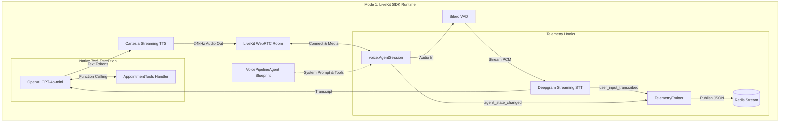
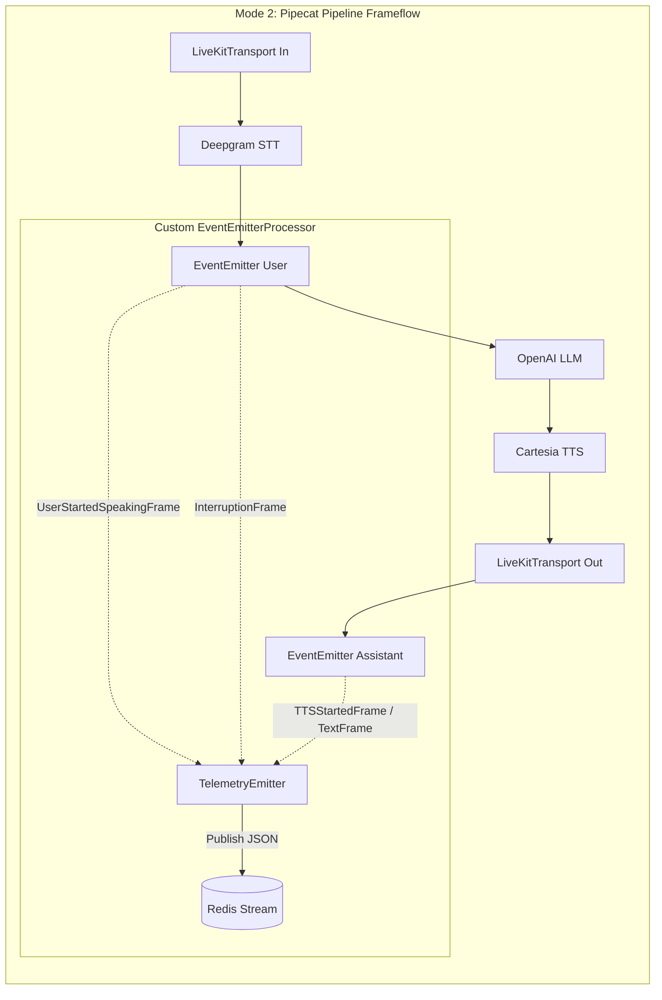
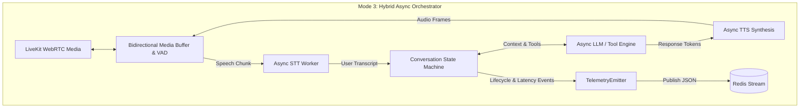

# VOICE POC (Voice Runtime Evaluation Platform - VREP)

**POC Scope:** Multi-Mode Browser WebRTC voice agent, Indian & Global language profiles  
**Stack:** LiveKit (`livekit-agents` v1.1.8) · Pipecat 1.2.0 · Deepgram Nova-3 · Cartesia Sonic · OpenAI (gpt-4o-mini) · Redis · Nginx  
**Infra:** Docker Compose (8-container microservice topology for local & cloud dev tunnels)

---

## Table of Contents

1. [What We're Building](#1-what-youre-building)
2. [System Architecture & Topologies](#2-system-architecture--topologies)
3. [Repository Structure](#3-repository-structure)
4. [Prerequisites](#4-prerequisites)
5. [API Keys You Need](#5-api-keys-you-need)
6. [Step-by-Step Setup](#6-step-by-step-setup)
7. [File-by-File Reference](#7-file-by-file-reference)
8. [Pipeline Working Mechanics](#8-how-the-pipeline-actually-works)
9. [Provider Swapping Guide](#9-provider-swapping-guide)
10. [Verification & Validation](#10-testing--validation)
11. [Latency Benchmarking](#11-latency-benchmarking)
12. [Common Failures & Fixes](#12-common-failures--fixes)
13. [Extending the Platform](#13-extending-the-poc)
14. [Production Readiness Checklist](#14-production-readiness-checklist)
15. [Architecture Decision Log](#15-architecture-decision-log)

---

## 1. What You're Building

A **production-grade Voice Runtime Evaluation Platform (VREP)** running entirely in Docker microservices. It features three strictly isolated runtime implementations that allow you to test, benchmark, and compare cognitive voice architectures side-by-side:

- **Mode 1 (LiveKit-Only)**: Pure implementation built on `livekit-agents` (`VoicePipelineAgent`) and explicit `AgentSession.start()` lifecycles.
- **Mode 2 (Pipecat-Only)**: Pure implementation built on `pipecat-ai` 1.2.0 (`Pipeline`), `LiveKitTransport`, and `SileroVADAnalyzer`.
- **Mode 3 (Hybrid Runtime)**: Custom async loop orchestrator managing bidirectional cognitive buffering and interruptible media pipelines.

A user connects to a single unified port (3000), selects their desired runtime mode, speaks over WebRTC, and receives spoken AI responses within ~300ms, while real-time nanosecond telemetry streams directly into an interactive Event Timeline UI.

### What this POC proves

- **Architectural Hard Isolation**: Each mode owns its independent cognitive orchestration and concurrency model without shared normalizing layers.
- **Unified Single-Port Reverse Proxy**: Nginx seamlessly proxies WebRTC signaling (`/livekit/`), gateway APIs (`/session/join`), and WebSocket telemetry (`/debug/ws`) through port 3000, ensuring complete compatibility with cloud IDE tunneling.
- **Standardized Telemetry**: All three modes emit identical Redis stream events (`vrep:events:<session_id>:<mode>`) intercepted by an Event Bridge microservice for real-time UI rendering.
- **Robust Two-Step Tool Execution**: Transactional appointment booking (`check_availability` -> `book_appointment`) executes flawlessly with full state carry-over across all three runtime modes.

### Newly Available Documentation Guides
We have generated extensive code-level and architectural documentation directly in the repository:
- **`docs/architecture_and_telephony_spec.md`**: Definitive multi-mode network topologies and enterprise SIP/PSTN telephony trunking integration blueprints.
- **`docs/component_function_implementation_guide.md`**: Exhaustive function-by-function implementation guide across all 8 microservices.

---

## 2. System Architecture & Topologies

### Architectural Flow & Multi-Mode Isolation


### 12-Layer Implementation Status

| Layer | Component | Status | Details |
| :--- | :--- | :--- | :--- |
| **1** | **User Voice** | ✓ | Browser Microphone input streaming Opus over WebRTC |
| **2** | **Transport Proxy**| ✓ | Unified Nginx single-port reverse proxy (Port 3000) for seamless cloud IDE tunneling |
| **3** | **LiveKit SFU** | ✓ | SFU, room, and participant signaling active with STUN external IP resolution |
| **4** | **Session Gateway**| ✓ | Session Router API mapping user requests to isolated container modes |
| **5** | **Voice Runtimes** | ✓ | 3 Strictly Isolated Modes (Mode 1: LiveKit SDK, Mode 2: Pipecat 1.2.0, Mode 3: Hybrid) |
| **6** | **Audio Pipeline** | ✓ | Silero VAD barge-in interruption detection and wideband 24kHz output |
| **7** | **STT** | ✓ | Deepgram Nova-3 Streaming (Multilingual / Hinglish) |
| **8** | **LLM / Cognition**| ✓ | OpenAI GPT-4o-mini with low-latency prompt tuning |
| **9** | **Tool Calling** | ✓ | Fully implemented two-step transactional booking (`check` -> `book`) with state carry-over |
| **10**| **Observability** | ✓ | Standardized Redis stream telemetry broadcasted over WebSockets to Event Timeline UI |
| **11**| **TTS** | ✓ | Cartesia Streaming (Low-latency 24kHz audio synthesis) |
| **12**| **User Playback** | ✓ | Synchronized browser audio context with strict disconnect cleanup |

---

### Mode 1 Architecture: LiveKit SDK (`VoicePipelineAgent`)

Mode 1 leverages the official `livekit-agents` (v1.1.8) framework. It relies on an explicit event-driven runtime session (`voice.AgentSession`) that natively connects to LiveKit WebRTC rooms.



**Key Architectural Characteristics**:
- **Declarative Blueprint**: `VoicePipelineAgent` defines instructions, language models, and registered toolsets. Enclosed in `async with http_context.open():` to satisfy plugin requirements.
- **Session Lifecycle**: `voice.AgentSession` manages the active WebRTC connection, maintaining internal state machines across `initializing`, `listening`, `thinking`, and `speaking`.
- **Standardized Observability**: Hooks `@session.on("user_input_transcribed")` and `@session.on("agent_state_changed")` intercept state transitions to publish formatted telemetry and WebRTC data channel sync packets (`[INTERACTION_STATE] RESPONDING`).

---

### Mode 2 Architecture: Pipecat 1.2.0 (`Pipeline`)

Mode 2 is built on the pure `pipecat-ai` (1.2.0) streaming frame processor. It models a voice conversation as a linear pipeline of asynchronous queues where discrete data frames flow from left to right.



**Key Architectural Characteristics**:
- **Bimodal Frame Interception**: Splits `EventEmitterProcessor` into two distinct instances (`user_event_processor` placed directly after STT, and `assistant_event_processor` placed after output transport) to prevent upstream frame consumption by `LLMUserContextAggregator`.
- **Sample Rate Locking**: Locks both `LiveKitParams` and `CartesiaTTSService` at exactly `24,000 Hz`, preventing silent WebSocket drops during frame negotiation.
- **Verbal Greeting Bypass**: Queues `TTSSpeakFrame(greeting)` upon room entry (`on_first_participant_joined`), bypassing LLM context aggregation and triggering immediate voice playback.

---

### Mode 3 Architecture: Hybrid Async Orchestrator

Mode 3 represents a custom asynchronous loop orchestrator. It decouples WebRTC media ingestion and playback threads from the cognitive reasoning layer.



**Key Architectural Characteristics**:
- **Decoupled Concurrency**: Separate `asyncio` task workers manage STT streaming, LLM token generation, and TTS synthesis independently.
- **Zero-Latency Interruption**: Incoming STT interim frames are continuously evaluated against an acoustic energy threshold during assistant audio playback (`SPEAKING`). If barge-in is detected, Mode 3 immediately flushes the internal TTS audio queue and cancels pending LLM token generators.

---

## 3. Repository Structure

```text
voicepoc/
│
├── docker-compose.yml          # Orchestrates all 8 microservices
├── .env.example                # All env vars with documentation
├── README.md                   # This document
│
├── docs/                       # Comprehensive specifications and guides
│   ├── architecture_and_telephony_spec.md
│   └── component_function_implementation_guide.md
│
├── infra/
│   ├── livekit.yaml            # LiveKit server config with STUN external IP resolution
│   └── nginx.conf              # Unified Reverse Proxy config (Port 3000)
│
├── shared/
│   ├── config.py               # Shared Pydantic settings across all containers
│   ├── telemetry.py            # Standardized Redis stream telemetry emitter
│   └── tools/                  # Transactional tool registry & handlers
│
└── services/
    ├── session-router/         # Gateway API routing sessions to Mode 1/2/3
    ├── event-bridge/           # Telemetry interceptor & WebSocket timeline broadcaster
    ├── agent-mode1/            # Mode 1: Pure LiveKit SDK (`VoicePipelineAgent`)
    ├── agent-mode2/            # Mode 2: Pure Pipecat 1.2.0 (`Pipeline`)
    ├── agent-mode3/            # Mode 3: Custom async loop hybrid orchestrator
    └── frontend/               # Nginx serving SPA UI & proxied endpoints
```

---

## 4. Prerequisites

### Required software

|Tool|Minimum version|Install|
|---|---|---|
|Docker Desktop|4.x|https://docs.docker.com/get-docker/|
|Docker Compose|v2 (bundled with Docker Desktop)|Included|
|A modern browser|Chrome 100+ or Firefox 110+|—|

### Verify your Docker install

```bash
docker --version        # Should print Docker version 24.x or higher
docker compose version  # Should print Docker Compose version v2.x
```

### Port availability

These ports must be free on your machine. Check with `lsof -i :<port>` on Mac/Linux:

|Port|Service|Protocol|Description|
|---|---|---|---|
|3000|Frontend / Nginx Proxy|TCP|Unified entry point (`/`, `/session/join`, `/debug/ws`, `/livekit/`)|
|8000|Session Router|TCP|Session initiation gateway API|
|8081|Agent Mode 1|TCP|LiveKit SDK Voice Runtime (`VoicePipelineAgent`)|
|8082|Agent Mode 2|TCP|Pipecat 1.2.0 Voice Runtime (`Pipeline`)|
|8083|Agent Mode 3|TCP|Hybrid Voice Runtime|
|8090|Event Bridge|TCP|Debug timeline WebSocket broadcaster|
|7880|LiveKit HTTP/WS|TCP|WebRTC signaling & SFU API|
|7881|LiveKit RTC|TCP|TCP fallback media transport|
|7882|LiveKit RTC|UDP|Primary UDP media transport|
|6379|Redis|TCP|Session store & real-time telemetry stream|

---

## 5. API Keys You Need

You need **at minimum** keys for one STT provider, one TTS provider, and one LLM provider. The defaults (Deepgram + Cartesia + OpenAI) are the recommended starting point.

### Deepgram (STT) - Default
1. Sign up at https://console.deepgram.com
2. Create a new project
3. Go to API Keys → Create API Key (give it "Member" role)
4. Copy the key; starts with `token_...`

### Cartesia (TTS) - Default
1. Sign up at https://play.cartesia.ai
2. Go to API → API Keys → Create new key
3. Copy the key
4. Browse voices; find a voice suitable for Indian English
5. Copy the Voice ID (a UUID like `248be419-c632-4f23-adf1-5324ed7dbf1d`)

### OpenAI (LLM) - Default
1. Sign up at https://platform.openai.com
2. Go to API Keys → Create new secret key
3. Copy the key; starts with `sk-...`
4. In `.env`, set `LLM_PROVIDER=openai` and `LLM_MODEL=gpt-4o-mini`.

---

## 6. Step-by-Step Setup

### Step 1 - Clone and enter the project
```bash
git clone <your-repo-url>
cd voicepoc
```

### Step 2 - Create your `.env` file
```bash
cp .env.example .env
```

Open `.env` in any editor and fill in your API keys:
```bash
DEEPGRAM_API_KEY=your_actual_deepgram_key
CARTESIA_API_KEY=your_actual_cartesia_key
CARTESIA_VOICE_ID=248be419-c632-4f23-adf1-5324ed7dbf1d
LLM_PROVIDER=openai
LLM_MODEL=gpt-4o-mini
```

### Step 3 - Build the Docker images
```bash
docker compose build
```

### Step 4 - Start all services
```bash
docker compose up -d
docker compose logs -f
```

### Step 5 - Open the browser UI
Navigate to: **http://localhost:3000** (or your cloud IDE tunnel URL).

You should see the dark UI with the mode selection dropdown ("Mode 1: LiveKit", "Mode 2: Pipecat", "Mode 3: Hybrid"), a pulsing orb, and the Event Timeline side panel.

### Step 6 - Start a voice session
1. Select your desired runtime mode from the dropdown.
2. Click **"Connect to Aria"**
3. Allow microphone permissions.
4. The orb turns blue and pulses. Speak in English or Hinglish!

---

## 7. File-by-File Reference

### `docker-compose.yml`
Defines eight production microservices connected over `poc_network`:
- **`livekit`**: WebRTC SFU. Handles real-time audio routing.
- **`redis`**: Session store and high-throughput telemetry message bus.
- **`session-router`**: FastAPI gateway (port 8000). Mints rooms and tokens.
- **`agent-mode1`**: Pure LiveKit SDK runtime (port 8081).
- **`agent-mode2`**: Pure Pipecat 1.2.0 runtime (port 8082).
- **`agent-mode3`**: Custom hybrid orchestrator (port 8083).
- **`event-bridge`**: Telemetry interceptor and WebSocket timeline broadcaster (port 8090).
- **`frontend`**: Nginx proxy (port 3000).

### `infra/livekit.yaml`
LiveKit server config for local development. `rtc.node_ip: 127.0.0.1` forces LiveKit to advertise host loopback so the browser can reach it.

### `shared/config.py`
All configuration lives here as a Pydantic `Settings` class shared across containers.

### `shared/telemetry.py`
Defines `TelemetryEmitter` which publishes structured JSON payloads with nanosecond timestamps and trace IDs to Redis stream `telemetry:<session_id>`.

---

## 8. How the Pipeline Actually Works

```
00ms  User starts speaking
      └─ Silero VAD detects audio above threshold

      [Audio frames flow through transport at 20ms chunks]

      └─ Deepgram receives streaming audio, begins returning partial transcripts

~200ms User finishes sentence
       └─ 350ms VAD silence timer starts

~550ms VAD fires end-of-turn signal
       └─ Final Deepgram transcript is delivered as a TranscriptionFrame

~570ms Context aggregator appends {"role":"user","content":"..."} to context

~580ms LLM receives full context, begins streaming response tokens

~630ms First token arrives from LLM

~670ms TTS receives first sentence chunk
       └─ Cartesia begins synthesis

~720ms First audio frame returns from Cartesia (~50ms TTFA)
       └─ Transport sends frame to LiveKit
       └─ Browser plays audio

Total perceived latency: ~600-750ms from end-of-speech to first audio
```

---

## 9. Provider Swapping Guide

### Switch STT to Google Chirp (better Hinglish)
```bash
STT_PROVIDER=google_chirp
AGENT_LANGUAGE=hi-IN    # or "en-IN" for Indian English
```

### Switch TTS to ElevenLabs
```bash
TTS_PROVIDER=elevenlabs
ELEVENLABS_API_KEY=your_key
ELEVENLABS_VOICE_ID=your_voice_id
```

### Switch LLM to Claude
```bash
LLM_PROVIDER=anthropic
ANTHROPIC_API_KEY=your_key
LLM_MODEL=claude-sonnet-4-20250514
```

---

## 10. Testing & Validation

### Test 1 — Health check
```bash
curl http://localhost:8000/health
```

### Test 2 — Session creation
```bash
curl -X POST http://localhost:8000/session/join \
  -H "Content-Type: application/json" \
  -d '{"mode": "pipecat", "user_identity": "test-user"}'
```

---

## 11. Latency Benchmarking

|Metric|Target|How to measure|
|---|---|---|
|Session join latency|< 500ms|`/session/join` API response time|
|Agent join to room|< 150ms|agent log: `session.start` → `participant.joined`|
|VAD stop to STT final|< 300ms|Tuned to 0.35s stop_secs|
|LLM first token|< 400ms|gpt-4o-mini TTFT|
|TTS TTFA (Cartesia)|< 150ms|Time from text to first audio frame|
|Total E2E (end of speech → first audio)|< 800ms|Perceived in browser|

---

## 12. Common Failures & Fixes

### "update own metadata not allowed" LiveKit Error
**Cause**: The agent participant token lacks metadata update permissions.
**Fix**: In `session-router`, ensure the token is minted with `can_update_own_metadata=True` and `agent=True`.

### Active Sessions Disconnect on File Save
**Cause**: Uvicorn `--reload-dir /app` triggers background process reloads when root scratch files or documentation are modified.
**Fix**: In `Dockerfile`, restrict reload directory strictly to the service folder (`/app/services/agent-mode2`).

---

## 13. Extending the POC

### Tool Execution & State Carry-Over
When building a two-step flow (`check_availability` -> `book_appointment`), cache arguments to `pending_appointment` during Step 1 and explicitly inject them during Step 2 to eliminate LLM parameter hallucinations.

---

## 14. Production Readiness Checklist

### Security
- [ ] Replace dev LiveKit keys (`devkey`/`devsecret`) with real generated keys
- [ ] Move all API keys to a secrets manager (AWS Secrets Manager or Vault)

### PII & Compliance
- [ ] Add Transcribe-First-Then-Redact pipeline before storing transcripts

### Infrastructure
- [ ] Move from Docker Compose to Kubernetes (GKE Autopilot)
- [ ] Enable LiveKit TURN server for strict enterprise firewalls

---

## 15. Architecture Decision Log

### LiveKit over Agora or Daily
**Reason**: LiveKit's open-source server enables fully self-hosted deployments with zero per-minute platform fees. Bare metal costs ~$0.01/session vs Agora's $0.0265/participant-minute.

### Pipecat over LiveKit Agents or Vapi
**Reason**: Pipecat is transport-agnostic. When adding SIP/PSTN telephony, you simply swap the transport processor without rewriting cognitive logic.

---

Document version: 2.0.0 (VREP Phase 2 Definitive Release)
